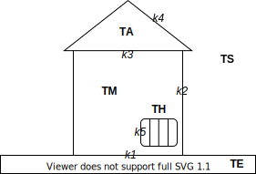
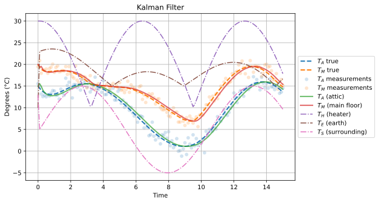

# Kalman Filter Application With Newton's Law of Cooling

This project supposes a (simplified) dynamic system that models the heating of a house as illustrated in the figure below; inspired by [[1](https://www.sharetechnote.com/html/DE_Modeling_Example_Cooling.html)].

- $T_A$...temperature of the **attic**
- $T_S$...temperature of the **surrounding**
- $T_E$...temperature of the **earth**
- $T_H$...temperature of the **heater**
- $T_M$...temperature of the **main floor**
- $k_1,k_2,k_3,k_4,k_5$...coefficients of heat transfer

Based on [Newton's law of cooling](https://en.wikipedia.org/wiki/Newton%27s_law_of_cooling), this situation can be modeled by a system of two linear ODEs:

$$
\left\{\begin{array}{rl}
        T_M' &= k_1(T_M-T_E) + k_2(T_M-T_S) + k_3(T_M-T_A) + k_5(T_M-T_H),\\
        T_A' &= k_3(T_A-T_M) + k_4(T_A-T_S).
\end{array}\right.
$$

The goal is to design a [Kalman filter](https://github.com/rlabbe/Kalman-and-Bayesian-Filters-in-Python) to accommodate inaccurate temperature measurements.

## Kalman Filter

Kalman filter can be summarized using the following equations:

$$
\begin{array}{|l|l|}
\hline
\text{Prediction} & \text{Update}\\
\hline
\hat{\mathbf{x}}=\mathbf{F}\mathbf{x}+\mathbf{B}\mathbf{u} & \mathbf{y}=\mathbf{z}-\mathbf{H}\hat{\mathbf{x}} \\
\hat{\mathbf{P}}=\mathbf{F}\mathbf{P}\mathbf{F}^\mathsf{T}+\mathbf{Q} & \hat{\mathbf{K}}=\hat{\mathbf{P}}\mathbf{H}^\mathsf{T}(\mathbf{H}\hat{\mathbf{P}}\mathbf{H}^\mathsf{T}+\mathbf{R})^{-1}  \\
& \mathbf{x}=\hat{\mathbf{x}}+\mathbf{K}\mathbf{y}\\
& \mathbf{P}=(\mathbf{I}-\mathbf{K}\mathbf{H})\hat{\mathbf{P}}\\
\hline
\end{array}
$$

To tackle the aforementioned problem, I employ Euler's method to approximate the ODEs. Based on these approximations, I generate true and noisy temperature measurements. Subsequently, I apply the Kalman filter. The figure below displays one outcome of the simulation. For further details, please refer to the file [`newton_cooling.ipynb`](newton_cooling.ipynb).

